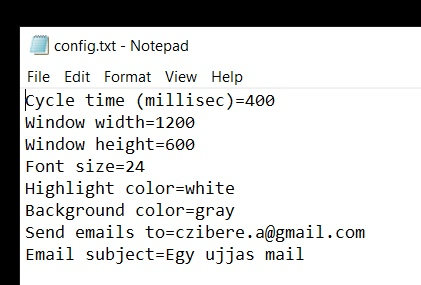
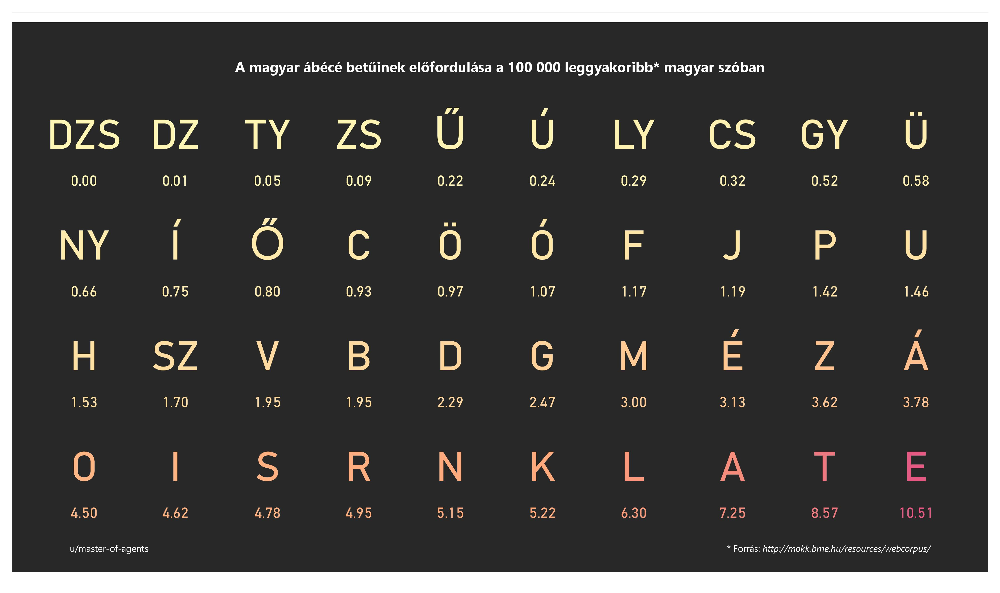

# 1BitTyper

On this page you can find a description of 1BitTyper and a short summary of why I came up with it. 

## Background story

In 2024, I was following [Dániel Karsai's](https://hu.wikipedia.org/wiki/Karsai_D%C3%A1niel) struggle to the right of euthanasia. At one point, Hungarian Head of state Sulyok Tamás [wrote him a letter](https://telex.hu/belfold/2024/06/03/karsai-daniel-alkotmanyjogasz-elnoki-kegyelem-sulyok-tamas-koztarsasagi-elnok). As one of Dániel's weapon was publicity he shared the letter in a pdf document on his Google Drive.
I decided to reach out to Dániel offering the [Careless-AudioBookPlayer](https://github.com/gitusercz/CABP) for use. 
He replied soon for my e-mail. He was not interested in listening to audiobooks, but was interested in making possible reading alone and a tool that made him easier to communicate. 
So, I came up with two pilot projects. 
## Blink pager 
Following a [PyImageSearch](https://pyimagesearch.com/2017/04/24/eye-blink-detection-opencv-python-dlib/) tutorial, I was able to build a pdf reading application, that was using the webcam to monitor the reader and turn the page upon a long blink. Telling the long intentional and short unintentional blinks apart was not easy. The tutorial was ending at the computer recognizing the blinks, I took it furter to recognize only long blinks and convert them to pyautogui simulated keypresses. 

 
 ## 1Bit Typer
I have built this application first to work with a mouse button. 

  

Since upload of the video, some new features got implemented:

The typed message gets sent to a pre defined mail address with a pre defined mail subject. 

The typed message is read aloud with Windows' voice. It speaks Hungarian surprisingly well. 

Here are the parameters that can be set for this application: 

In finding the best order for characters I researched for the occurence rate of letters in hungarian words, and found this statistics. This was the base I designed which characters should go to the most accessible places. 

I was to merge this project with blinking detection, which eventually did not happen. 
Czibere Attila, 2025-01
